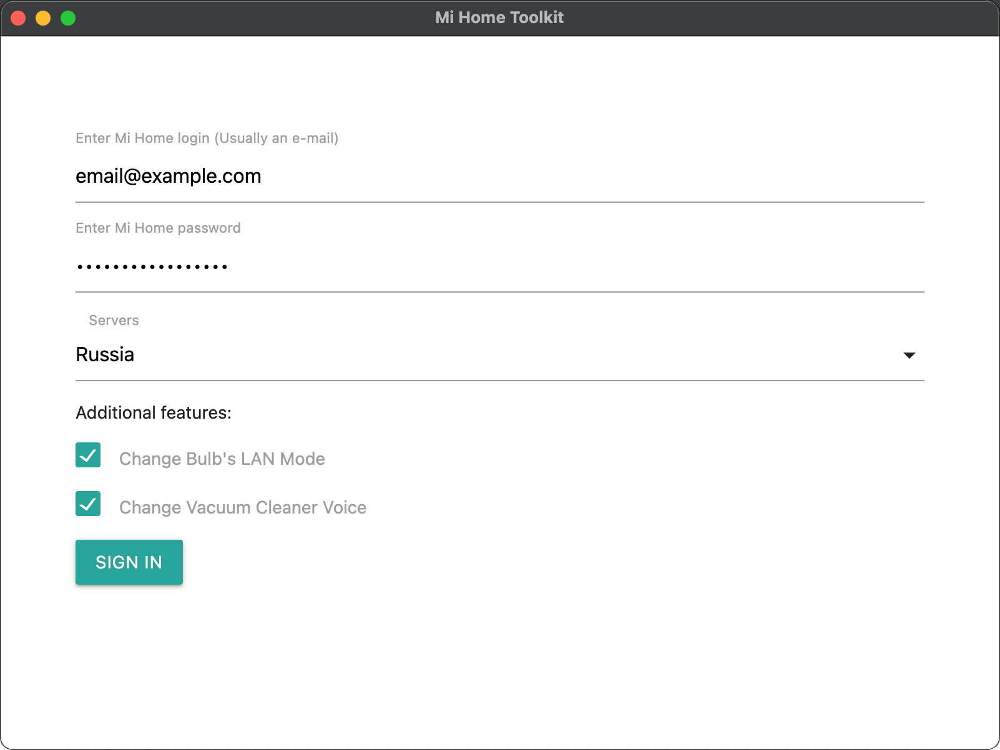
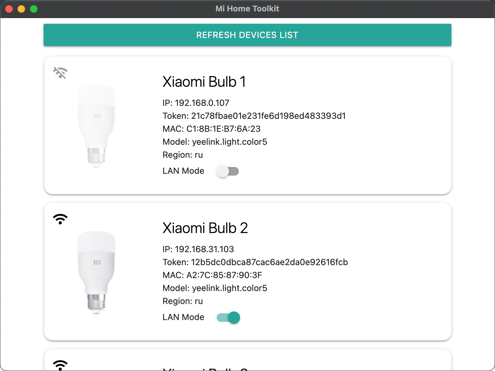

# MiHomeToolkit

A versatile tool for managing Mi Home smart devices.

## Features

- View device information, including tokens
- Enable LAN mode for bulbs

## Usage

### 1. Login



### 2. Use the app



## Why desktop app?

Although the `node-mihome` package allows signing in to a MiHome account and accessing devices, it's not feasible for browser use due to the inability to handle request headers within the browser environment:

```js
// _loginStep3() {
const headers = res.headers.raw()
const cookies = headers['set-cookie']
```

## Download

[Releases](../../releases)

## Install dependencies

```sh
npm i
```

MiHomeToolkit Windows / MacOS app.

## Run on dev mode

```sh
npm start
```

### The electron folder is created in the project director and applications will be built there.

### Build Windows

```sh
npm run win
```

### Build Mac

```sh
npm run mac
```
